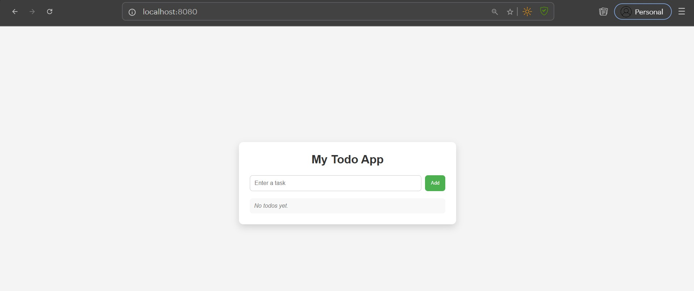
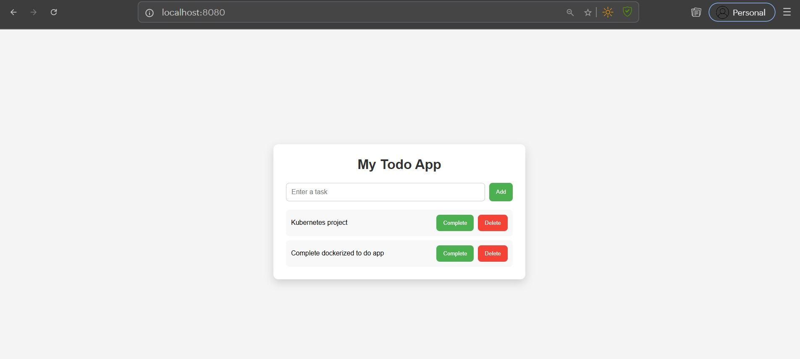
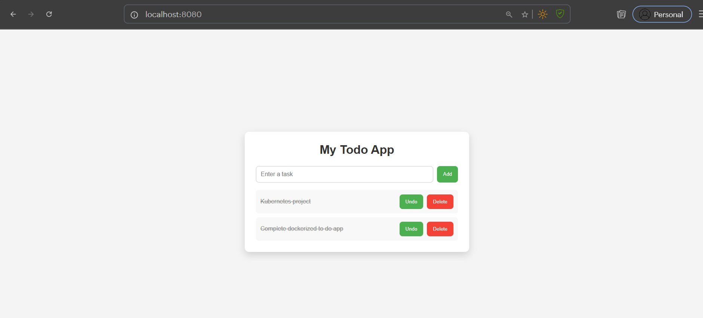

## Dockerized Full-Stack Todo Application

A full-stack Todo application built using HTML, CSS, JavaScript, Node.js, Express.js, MongoDB, Docker, Docker Compose, and Nginx.

The application allows users to create, view, update, and delete todos through a simple and responsive web interface. The frontend is served using Nginx, API requests are handled by an Express backend, and all todo data is stored in MongoDB.

-----------

## Features

- Add new todos
- View all todos
- Mark todos as Complete / Undo
- Delete todos
- Delete confirmation dialog
- Prevent empty todo creation
- Display "No todos yet" when the list is empty
- Add todos using the Enter key
- Responsive and modern UI
- Dockerized frontend and backend
- Reverse proxy using Nginx
- Persistent MongoDB storage using Docker volumes

------------

## Tech Stack

| Category        | Technologies                 |
|-----------------|------------------------------|
| Frontend        | HTML, CSS, JavaScript        |
| Backend         | Node.js, Express.js          |
| Database        | MongoDB                      |
| DevOps          | Docker, Docker Compose, Nginx|
| Version Control | Git, GitHub                  |

------------

## Architecture


                Browser
                    │
                    ▼
          Nginx (Frontend)
                    │
                    ▼
        Node.js + Express API
                    │
                    ▼
              MongoDB Database

------------

## Project Structure

```text
todo-app/
│
├── backend/
│   ├── models/
│   │   └── Todo.js
│   ├── Dockerfile
│   ├── package.json
│   └── server.js
│
├── frontend/
│   ├── Dockerfile
│   ├── index.html
│   ├── style.css
│   ├── script.js
│   └── nginx.conf
├──screenshots
├── .gitignore
├── docker-compose.yml
└── README.md
```


## Prerequisites

Before running this project, install:

- Docker
- Docker Compose
- Git

---

## Installation

Clone the repository:

```bash
git clone <repository-url>
```

Navigate to the project directory:

```bash
cd todo-app
```

Build and start all services:

```bash
docker compose up --build
```

Open your browser and visit:

```
http://localhost:8080
```

---

## API Endpoints

| Method  | Endpoint     | Description               
|---------|--------------|------------------------------|
| GET     | `/todos`     | Retrieve all todos           |
| POST    | `/todos`     | Create a new todo            |
| PUT     | `/todos/:id` | Update todo completion status| 
| DELETE  | `/todos/:id` | Delete a todo                |

---

## Screenshots

### Empty State



### Todo List



### Completed Todo



---

## Future Improvements

- Edit existing todos
- Search todos
- Filter completed and pending todos
- User authentication
- Due dates
- Categories
- Dark mode

---

## Author

**Raghuram I**

GitHub: https://github.com/raghucraft

---